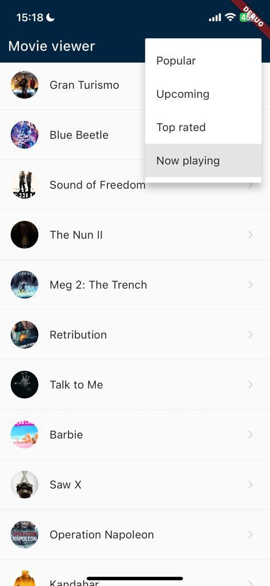

# TMDB App

### Open source TMDB application that uses clean architecture and Cubits as the state management solution.

<p float="left">



</p>

## Features

- List and filter movies by "Popular", "Upcoming", "Now playing" and "Top rated".
- Search for movies by providing a query string.
- View the movie poster, description and overall rating.

## Libraries

- flutter_bloc
- dio
- go_router
- equatable
- provider
- cached_network_image
- rxdart
- mocktail (testing)
- bloc_test (testing)

## Lint rules

```
avoid_print: true
prefer_single_quotes: true
prefer_relative_imports: true
lines_longer_than_80_chars: true
```

## Running the app

To run the app, the `flutter run` command should be enough.

In case you want to change the `API_KEY` used by the application, you can replace it on the `constants.dart` file located in the `common` directory.

On iOS please make sure to run `pod install` before running to make sure all the dependencies are installed.

## Running the tests

Use the `flutter test` command to run the tests.

Only business logic components are unit tested.
